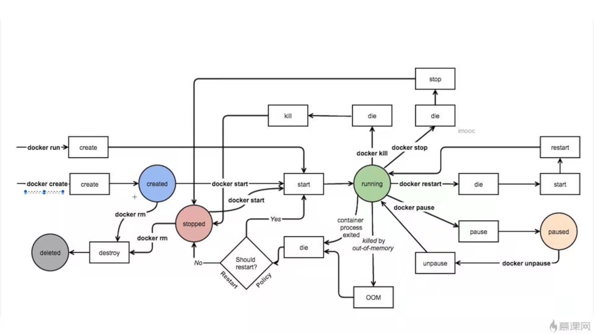

## docker 整体架构

```
1. client
2. docker host
3. docker daemon（后台引擎）
	3.1 dockerd
	3.2 配置文件
4. containers
	4.1 隔离-namespace(pid, net, ipc, mnt, uts)
	4.2 限制-cgroup(cpu, mem, io)
	4.3 文件系统-UnionFS(AUFS, btrfs, vfs, DeviceMapper)
5. images
	5.1 docker commit
	5.2 Dockerfile
6. registry
```


## docker 环境搭建

* 通过docker脚本进行安装docker

```shell
# 获取docker安装脚本
curl -fsSl get.docker.com -o get-docker.sh
# 安装docker
sh get-docker.sh --mirror Aliyun
# 重刷daemon
systemctl daemon-reload
# 重启docker
systemctl restart docker
```

* 离线安装docker

```shell
#1. 下载安装包
http://docker-release-purple-prod.s3-website-us-east-1.amazonaws.com/linux/centos/7/x86_64/stable/Packages/
#1.1 需要下载一个selinux包和docker包
docker-ce-selinux-17.03.2.ce-1.el7.centos.noarch.rpm
docker-ce-20.10.6-3.el7.x86_64.rpm
```


## docker 容器生命周期管理

* docker container 之 基础命令

```shell
# 拉取镜像
docker pull image
# 查看docker的正在运行容器
docker ps
# 查看docker的全部容器
docker ps -a
# 查看本地的docker镜像
docker images
# 创建镜像容器，但未启动容器
docker create imagename
# 以bash方式进入容器内部
docker exec -it containerid/containername /bin/bash
# 暂停/恢复 容器
docker pause/unpause containerid/containername
# 停止/启动 容器
docker stop/start containerid/containername
# 彻底删除容器(-f -> 强制删除，无序先停止容器)
docker rm -f containerid/containername
# 删除镜像
docker rmi imageid/imagename
# 查询容器日志(-f -> 不停刷新输出日志)
docker logs -f containerid/containername
# -c 指CPU资源权重，
docker run -d -c 4000 nginx
# -m 指内存占用200M，--memory-swap 指文件系统内200M作为缓存
docker run -d -m 200M --memory-swap=200M nginx
# --blkio-weight 指io比例
docker run -d --blkio-weight 1000 nginx
```


* docker container 之 状态机模型



* docker container 之 隔离与限制


## Dockerfile 实战

```shell
# 基于某个基础镜像
FROM baseimage
# 维护人员
MAINTAINER owner
# docker run 时执行
RUN mkdir test1
# docker build 时执行
COPY 源目录 目标路径
# docker build 时执行，可解压
ADD 源目录 目标路径
# 暴露容器的端口
EXPOSE 80
# 
VOLUME /data
# 多个时，只执行最后一个
ENTRYPOINT ["", "", ""]
# 没有entrypoint时，运行
# 有entrypoint时，作为参数传给entrypoint
# 不一定执行。外部不传参时，执行CMD
CMD ["", ""]
```


## docker 网络通讯

### 1. docker原生网络

* 默认网络

```
1. none网络
2. host网络
	与宿主机共用网络和端口等
3. bridge网络
	容器独立，通过端口映射进行访问
```

* 自定义网络

```
1. 自定义bridge网络
2. 自定义overlay网络
3. 自定义macvlan网络
```


### 2. 第三方网络

```
1. flannel网络
2. weave网络
3. calico网络
```


