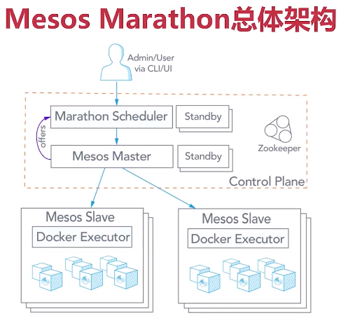

## 1. 整体架构 & 功能模块

### 1.1 整体架构图



### 1.2 Zookeeper 集群

```
1. zookeeper自身高可用
2. Mesos Master 领导者选举
3. 节点数目(2N+1)和Quorum数目(N+1)
```

### 1.3 Mesos Master

```
1. 主备模式
2. 沟通Mesos Slave，获取资源
3. 沟通framework，提供资源
```

### 1.4 Mesos Slave

```
1. 为各种框架提供执行器环境
2. 沟通Mesos Master，提供资源
3. 执行任务和容器管理
```

### 1.5 Marathon调度器

```
1. 一种主流框架的调度器
2. 对接Mesos Master，提供容器编排和应用调度
3. 与Mesos Slave端的执行器紧密呼应
```


## 2. 环境准备 & 原理剖析


## 3. 服务部署

 