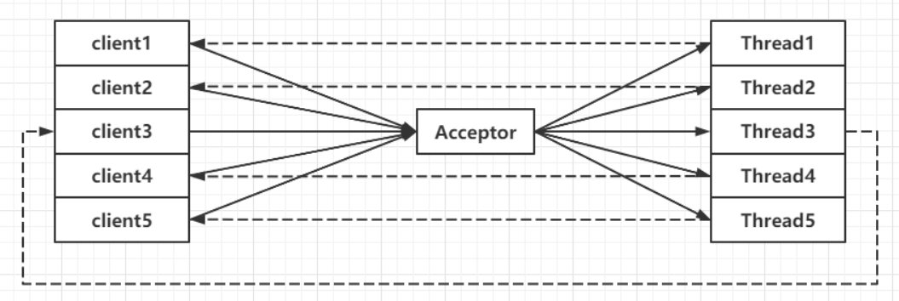
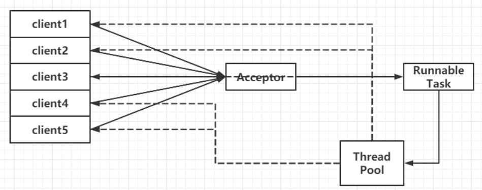

## Netty学习笔记

### 1. Java IO通信

#### 1.1 BIO通信(同步阻塞IO)

```
· 一个线程负责监听，创建新线程处理客户端请求
· 典型的一请求一应答模型
· 缺乏弹性伸伸缩能力(当客户端请求并发量上来后，服务端的监听线程为此创建过多的线程处理客户端请求，导致服务器资源容易耗尽)
```

#### BIO通信模型




#### 1.2 伪异步IO通信(同步阻塞IO)

```
· 线程池负责连接(将客户端请求封装成task，投递到线程池中进行处理)
· M请求N应答
· 线程池阻塞(资源可控，大量客户端请求，并发量大时，会造成线程池阻塞)
```

#### 伪异步IO通信模型




#### 1.3 NIO通信(同步非阻塞IO)

```
· 缓冲区Buffer
· 通道Channel
· 多路复用器Selector
```

#### 1.4 AIO通信(异步非阻塞IO)

```
· 连接注册读写事件和回调函数
· 读写方法异步
· 主动通知程序
```


### 2. Netty入门

#### 2.1 原生NIO的缺陷

```
1. 类库和API繁杂
2. 入门门槛高: 多线程,网络编程等
3. 工作量和难度大
4. JDK NIO存在bug
```

#### 2.2 Netty的优势

```
1. API简单
2. 入门门槛低
3. 性能高
4. 成熟,稳定
```


### 3. WebSocket入门

#### 3.1 什么是WebSocket?

```
1. H5协议规范
2. 握手机制(通过Http/Https请求进行握手, 建立用于交换数据的TCP连接)
3. 解决客户端与服务端实时通信而产生的技术
```

#### 3.2 WebSoket的优点

```
1. 节省通信开销
2. 服务器主动传送数据给客户端
3. 实时通信
```

#### 3.3 WebSocket建立连接

```
1. 客户端发起握手请求
2. 服务端响应请求
3. 连接建立
```

#### 3.4 WebSocket生命周期

```
1. 打开事件: 发生在新的连接时调用, 并且在其他任何事件发生之前.
			此事件伴随着三部分信息:WebSocket**对象, 用以表示已经建立好的连接
								配置对象,用以表示配置端点的信息
								一组路径参数,用以打开...
2. 消息事件: 
3. 错误事件: 
4. 关闭事件: 
```

#### 3.5 WebSocket关闭连接

```
1. 服务器关闭底层TCP连接
2. 客户端发起TCP close
```


