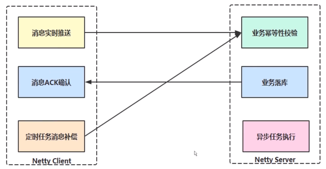

## 2. Netty 实战

### 2.1 数据可靠性通信场景分析与架构设计

```
1. 数据通信要求实时性高，且高性能，异构系统
2. 需要保障不同的业务对应不同的实现
3. 支持负载均衡策略、故障切换
4. 需要可靠性保障的支持，数据不允许丢失
```

### 2.2 高可靠性架构设计分析



### 2.3 Netty 整合 SpringBoot

```
1. proto的数据格式及类型的准备
2. 
```


 