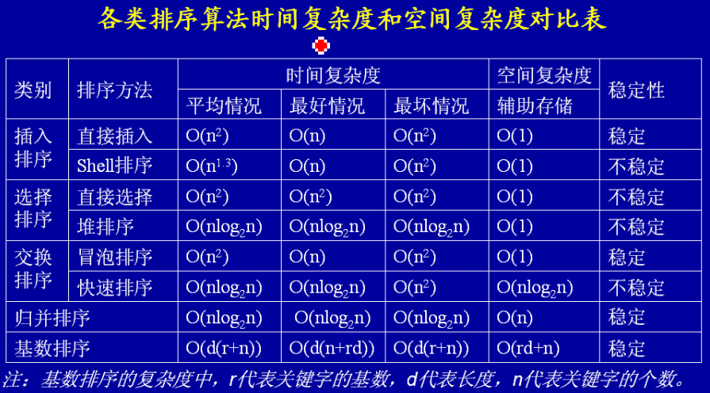

## 1. 考纲要求

### 1.1 数据结构

> 数组（静态数组、动态数组）、线性表、链表（单向链表、双向链表、循环链表）、队列、栈、树（二叉树、查找树、平衡树、线索树、堆）、图等的定义、存储和操作

### 1.2 算法

> 排序算法、查找算法、数值计算方法、字符串处理方法、数据压缩算法、递归算法、图的相关算法；
>
> 算法与数据结构的关系、算法效率、算法设计、算法描述（流程图、伪代码、决策表）、算法的复杂性。


## 2. 主要考查知识点

```
1. 线性表
2. 树和二叉树
3. 图
4. 排序算法
5. Hash
6. 查找算法
```


## 3. 数据结构

### 3.1 基本数据结构

```
1. 按逻辑结构分类
	1.1 集合(无逻辑关系)
	1.2 线性结构(线性表)
		1.2.1 一维数组
		1.2.2 队列
		1.2.3 栈
	1.3 非线性结构
		1.3.1 树
		1.3.2 图
		1.3.3 多维数组
2. 按存储结构分类
	2.1 顺序存储结构
	2.2 链式存储结构
	2.3 索引存储结构
	2.4 散列存储结构
```


### 3.2 线性表

```
1. 顺序表
	连续的存储空间
2. 链式表
	离散的存储空间，在物理上通过指针进行串联，使其连续
	2.1 单链表
	2.2 循环链表
	2.3 双向链表
3. 栈
	先进后出
4. 队列
	先进先出 
	4.1 线性队列
	4.2 循环队列 
```

* 链表的操作

```
单链表的结点删除
	将a1结点的指针域的指针跳过a2，直接指向a3
单链表的结点插入
	先将新结点的指针域的指针指向a2结点，然后将a1的指针域指针指向新结点

双链表的结点删除
	1. 将a1的后区指针指向a3的前区指针域，跳过a2
	2. 将a3的前区指针指向a1的后区指针域，跳过a2
双链表的结点插入
	1. 新结点的前区指针指向a1的后区指针域
	2. 将新结点的后区指针指向a2的前区指针域
	3. 将a2的前区指针指向新结点的后区指针域
	4. 将a1的后区指针指向新结点的前区指针域
```

* 顺序表和链表的比较

| 性能类别 | 具体项目 |             顺序存储             |               链式存储               |
| :------: | :------: | :------------------------------: | :----------------------------------: |
| 空间性能 | 存储密度 |             =1，更优             |                  <1                  |
|          | 容量分配 |             事先确定             |            动态改变，更优            |
| 时间性能 | 查找运算 |              O(n/2)              |                O(n/2)                |
|          |  读运算  |            O(1)，更优            | O([n+1]/2)，最好情况为1，最坏情况为n |
|          | 插入运算 | O(n/2)，最好情况为0，最坏情况为n |              O(1)，更优              |
|          | 删除运算 |            O([n-1]/2)            |              O(1)，更优              |


### 3.3 树和二叉树

* 树的基本概念

```
1. 结点的度
	与下一层结点相关联的数量，为结点的度
2. 树的度
	与下一层结点相关联的数量中，挑选最大的，为树的度
3. 叶子结点
	无下一层结点
4. 分支结点
	除了叶子结点，都叫分支结点（包括根结点）
5. 内部结点
	除了根节点和叶子结点，都叫内部结点
6. 父结点
7. 子结点
8. 兄弟结点
9. 层次
```

* 例子

```
在一棵度为3的树种，有2个度为3的节点，有1个度为2的节点，则有()个度为0的节点？
答：节点数 = 整棵树的度 + 1
整棵树的度 = 2*3 + 1*2
节点数 = 8 + 1 = 9
节点数 - 2 - 1 = 度为0的节点
```

* 树的遍历

```
1. 前序遍历
2. 后序遍历
3. 层次遍历
```

* 二叉树

```
1. 二叉树的第i层上最多有2^(i-1)个结点(i >= 1)
2. 深度为K的二叉树最多有2^k - 1个结点(k >= 1)
3. 对任何一棵二叉树，如果其叶子结点数为n0，度为2的结点数为n2，则n0 = n2 + 1
4. 如果对一棵有n个结点的完全二叉树的结点按层序编号（从第1层到(log2n的向下取整) + 1层，每层从左到右），则对任一结点i（1 <= i <= n），有：
	4.1 如果i=1，则结点i无父结点，是二叉树的跟；如果i>1，则父结点是(i/2的向下取整)
	4.2 如果2i>n，则结点i为叶子结点，无左子结点；否则，其左子结点是结点2i
	4.3 如果2i+1>n，则结点i无右子结点；否则，其右子结点是结点2i+1
```

* 二叉树的遍历

```
1. 前序遍历（先根遍历）
	根、左、右的顺序访问
2. 中序遍历
	左、根、右的顺序访问
3. 后序遍历（后根遍历）
	左、右、根的顺序访问
4. 层次遍历
```

* 树与二叉树的转换

```
1. 将除了左子结点外，其他子结点与父结点的连接剪断
2. 子结点之间连接，成为左子结点的有子结点

普通树的前序遍历 = 二叉树的前序遍历
普通树的后序遍历 = 二叉树的中序遍历
```

* 线索二叉树

```
1. 线索二叉树：
	
2. 如何将二叉树转化为线索二叉树：
	前序线索二叉树：
	中序线索二叉树：
	后序线索二叉树：
```

* 平衡二叉树

```
1. 平衡二叉树的提出原因
2. 平衡二叉树的定义
	一棵空树，或树中任一结点的左、右子树的深度相差不超过1
	定义结点的平衡度为其右子树的深度减去其左子树的深度，则对于平衡查找树，它每个结点的平衡度只能为-1,0,1三个值之一。
3. 平衡树的建立过程
	
4. 动态调平衡问题
	LL型平衡旋转：单向右旋平衡处理
	RR型平衡旋转：单向左旋平衡处理
	LR型平衡旋转：双向旋转，先左后右
	RL型平衡旋转：双向旋转，先右后左
```


### 3.4 图

* 图的基本概念

```
1. 图的构成
	一个图是由两个集合（V和E）组成的，V是有限的非空顶点（vertex）集合，E是用顶点对表示的边（edge）集合，图G的顶点集和边集分别记为V(G)和E(G)，而将图G表示为G = (V, E)也就是说，决定一个图需要知道它的顶点集合和边集合。

2. 无向图和有向图
	(B, D), <A, C>

3. 顶点的度
	关联该顶点的边的数量
	有向图的顶点度，分为入度和出度
		· 从顶点出发的边，算为出度
		· 指向顶点的边，算为入度

4. 子图
	设G‘和G是两个图，若有V(G') <= V(G), E(G') <= E(G)，则称G' 为G的子图；
	若有V(G') < V(G), E(G') < E(G)，则称G' 为G的真子图；

5. 完全图
	无向完全图：每对顶点之间都有一条边相连
	有向完全图：每对顶点之间都有二条有向边互相连接
	
6. 路径和回路
	路径：是由边所组成的，从一个顶点到另一个顶点所经历的边的数量
	回路：从一个顶点出发，经过其他顶点，并回到出发顶点
	
7. 连通图和连通分量
	无向连通图：任两个顶点之间，都有路径到达
	有向连通图：任两个顶点之间，都有相互到达的路径
	连通分量：一个图分成若干个图，每个图都是连通图

8. 网络
	图的边都加上权值

9. 图的存储
	· 邻接矩阵：假设图有n个结点，顶点编号为1,2,3...n，用一个n阶方阵R来存放图中各结点的关联信息，有邻接边的为1，无邻接边的为0
	· 邻接矩阵(带权)：两个顶点间有邻接边，则填权；
				顶点自身，填0；
				两顶点间无邻接边，填-1；
	· 邻接表(邻接链表)：首先把每个顶点的邻接顶点用链表表示出来，该表的结点结构可以设置为vertex link，这样n个顶点就有n个链表。然后用一个一维数组来顺序存储上面每个链表的头指针。一维数组的元素也可以设置为vertex link，这样只要知道了数组的元素，就可以确定该顶点与之相关联的顶点信息。
```


* 图的遍历

```
1. 深度优先
2. 广度优先
```


* 最小生成树

```
普利姆算法
	将图分成两个集合，任选一个出发点为目标集合中，出发点到另外集合中的其他点的权，选择最小的权对应的点，纳入目标集合中，再以此类推，以致全部点都纳入到目标集合中。

克鲁斯卡尔算法
	从所有边中权最小，次小，以此到将所有点都连通，并不形成回路。
```


* 拓扑排序

```
1. AOV网络
	把有向边表示活动之间开始的先后关系，这种有向图称为用定点表示活动网络，简称AOV网络。

2. 拓扑排序
	2.1 找入度为0的结点
	2.2 把2.1中的结点的出度移除
	2.3 重复2.1步骤
```


* 关键路径(最长路径)

```
1. AOE网络
	在AOV网络中，如果边上的权表示完成该活动所需的时间，则称这样的AOV为AOE网络

2. 重要概念：
	2.1 顶点J事件的最早发生时间：即从源头到顶点J的最长路径长度，记作Ve(J);
	2.2 活动ai的最早开始时间：Ve(J)是以顶点J为起点的出边所表示的活动ai的最早开始时间，记作e(i);
	2.3 顶点J事件的最迟发生时间：即在不推迟整个工程完全的前提下，一个事件J允许最迟的发生时间，记作VL(J);
	2.4 活动ai的最迟开始时间：VL(J) - (ai所需的时间)，就是活动ai的最迟开始时间，其中J是ai活动的重点，记作L(i)
```


## 4. 算法

### 4.1 排序算法

```
1. 常用排序算法的特点，以及具体处理过程
2. 常用排序算法的时间复杂度和空间复杂度
```

* 插入排序

```
1. 直接插入排序
	
2. 希尔算法(缩小增量排序)
```


* 选择排序

```
1. 简单选择排序

2. 堆排序
```


* 交换排序

```
1. 冒泡排序

2. 快速排序
```


* 归并排序

```
```


* 基数排序





### 4.2 Hash

```
1. 什么是Hash表
	散列表、杂凑表：十分实用的查找技术，具有极高的查找效率。
	关键字不同，求出的hash地址相同，称为冲突。
2. Hash函数的构造方法
	2.1 直接定址法：取关键字或关键字的某个线性函数值为哈希地址。
		即，H(key) = key 或 H(key) = a*key + b
	2.2 除余法：以关键字除以表元素总数后得到的余数为存储地址。
	2.3 基数转换法：将关键码看作是某个基数制上的整数，然后将其转换为另一基数制上的数。
	2.4 平方取中法：先通过求关键字的平方值扩大相近数的差别，然后根据表长度去中间的几位数作为哈希函数值。又因为一个乘积的中间几位数和乘数的每一位都相关，所以由此产生的散列地址较为均匀。
	2.5 折叠法：将关键字分成多段，左边段向右折，右边段向左折，然后将它们叠加。
	2.6 移位法：将关键字分为多段，左边段右移，右边段左移，再叠加。
	2.7 随机数法：选择一个随机函数，取关键字的随机函数值。
3. 处理冲突方法
	3.1 开放地址法（线性探查法和双散列函数法）
		当冲突发生时，使用某种探查技术在在散列中形成一个探序列。沿着该序列查找，知道找到关键字或一个开放的地址（地址单元为空）。
		线性探查法：冲突后直接向下线性找一个新的空间存放
		拉链法：将散列表的每个结点增加一个指针字段，用于链接同义词的子表，链表中的结点都是同义词。
	3.2 

4. 哈希表的查找
	
	
```


### 4.3 查找算法

```
ASL：平均查找长度

1. 顺序查找(ASL为(n+1)/2)
	从表的一端开始，按顺序比对当前结点与关键字是否相等的一种查找方式。
	
2. 二分查找法/折半查找法(ASL为log2(n+1)-1)
	要求待查序列为有序序列

3. 分块查找
	每块中的元素无序，但前一块的全部元素要小于后一块的全部元素，以此类推。
	索引表记录每块中最大的元素和每块的起始地址
	二分查找确定块：(ASL为log2(n/s+1)+s/2)
	顺序查找确定块：(ASL为(s^2 + 2s + n )/ 2s)  
```


## 分治法

```
定义：
	对于一个规模为n的问题，若该问题可以容易地解决则直接解决；否则将其分解为k个规模较小的子问题，这些子问题互相独立且与原问题形式相同，递归地解决这些子问题，然后将各个子问题的解合并得到原问题的解。

步骤：
	1. 分解（将原问题分解成一系列子问题）
	2. 求解（递归地求解各子问题，若子问题足够小，则直接求解）
	3. 合并（将子问题的解合并成原问题的解）

应用：
	二分查找和归并排序都是使用分治法

时间复杂度：O(log2N)
```

## 回溯法

```
定义：
	有“通用的解题法”之称，可以系统地搜索一个问题的所有解或任一解。
	在包含问题的所有解的解空间树中，按照深度优先的策略，从根节点出发搜索解空间树。
	搜索至任一结点时，总是先判断该阶段是否肯定不包含问题的解，如果不包含，则跳过对以该结点为根的子树的搜索，逐层向其祖先结点回溯；否则，进入该子树，继续按深度优先的策略进行搜索。
	可以理解为先进行深度优先搜索，一直向下探测，当此路不通时，返回上一层探索另外的分支，重复此步骤，这就是回溯。
	一般用于解决迷宫类的问题。
```

## 动态规划法

```
定义：
	在求解问题中，对于每一步决策，列出各种可能的局部解，再依据某种判定条件，舍弃哪些肯定不能得到最优解的局部解，在每一步都经过筛选，以每一步都是最优解来保证全局是最优解。
	本质也是将复杂的问题划分成若干个子问题，与分治法不同的是每个子问题间不是相互独立的，并且不全都相同。
	常用于求解具有某种最优性质的问题。

时间复杂度：O(nW)
```

## 贪心法

```
定义：
	总是做出在当前来说是最好的选择，而并不从整体上加以考虑，它所做的每步选择只是当前步骤的局部最优选择，但从整体来说不一定是最优的选择。由于它不必为了寻找最优解而穷尽所有的可能解，因此其耗费时间少，一般可以快速得到满意的解，但得不到最优解。
	局部贪心，只针对当前的步骤取最优，而非整体考虑。
	判断此类算法，看算法是否每一步都去最优，并且题意没有透露出最终结果是最优的。

时间复杂度：O(N^2)
```


 


